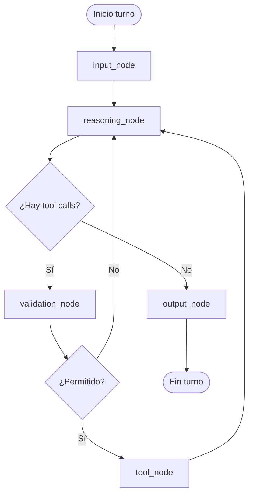

# SANTO GRIAL — Todo en un archivo (consolidado para compartir)

> **Qué es esto:** una sola pieza de documentación para pegar en ChatGPT, subir a Drive o archivar. Resume puerta de entrada, índice del análisis, claves de arquitectura, reporte del pipeline, blueprint del agente, mapeo LangGraph y cadena de ejecución confirmada.
> **Qué NO es:** no sustituye el corpus completo en `SANTO_GRIAL_ANALYSIS/output/` (miles de archivos) ni `PROJECT_INDEX.json`. Para código fuente reconstruido, abre esa carpeta.
> **Ruta de esta carpeta:** `c:\Users\Hans\Proyectos\SANTO GRIAL\CONSOLIDADO_PARA_COMPARTIR`

---


---

## PARTE 1 — Puerta de entrada (README hub)

# Puerta de entrada — referencia reconstruida (análisis del producto tipo “Claude Code”)

**Importante:** El trabajo de “toda la noche” y los **gigabytes de material reconstruido** **no** están solo en este README. Viven principalmente en la carpeta hermana del repo:

**`SANTO_GRIAL/SANTO_GRIAL_ANALYSIS/`**

Desde esta ubicación (`agent_sandbox/CLAUDE_CODE_SOURCE_REFERENCE/`), ruta relativa:

**`../../SANTO_GRIAL_ANALYSIS/`**

Esta carpeta (`CLAUDE_CODE_SOURCE_REFERENCE`) es el **mostrador ordenado**: reglas de aislamiento, índice maestro, síntesis de claves y copia del sandbox para auditores — **sin sustituir** el árbol de análisis.

---

## Qué abrir primero (orden recomendado)

| Orden | Archivo | Para qué |
|------|---------|----------|
| 1 | [`INDICE_MAESTRO.md`](INDICE_MAESTRO.md) | Mapa de **todo** lo que generó el pipeline (carpetas, conteos, enlaces). |
| 2 | [`CLAVES_REINGENIERIA_SINTESIS.md`](CLAVES_REINGENIERIA_SINTESIS.md) | **Claves de arquitectura** en una sola lectura (flujo, archivos ancla, loop agente, LangGraph). |
| 3 | `../../SANTO_GRIAL_ANALYSIS/REPORTE_FINAL.md` | Totales verificados (output, índice, núcleo consolidado). |
| 4 | `../../SANTO_GRIAL_ANALYSIS/SYSTEM_BRAIN_CONFIRMED.md` | Cadena de llamadas **confirmada** en código reconstruido (cli → main → REPL → query). |
| 5 | `../../SANTO_GRIAL_ANALYSIS/SYSTEM_BLUEPRINT/` | Blueprint abstracto + diagramas + mapeo LangGraph. |

---

## Reglas de aislamiento (sistema ejecutable)

- El código bajo `SANTO_GRIAL_ANALYSIS/output/` y derivados es **referencia / análisis**, no el pipeline de **`agent_sandbox`** ni AG-EVIDENCE.
- **No ejecutes** ese árbol como si fuera tu agente de producción sin revisión.
- **No importes** rutas cruzadas desde `agent_sandbox/*.py` hacia `output/src` sin un diseño explícito.
- Cualquier producto “inspirado” en este análisis debe ser **reinterpretación propia**, no copia literal de binarios ni de material con licencia ajena.

---

## Subcarpetas aquí

| Carpeta | Contenido |
|---------|-----------|
| **`AGENT_SANDBOX_SOURCE_FOR_AUDIT/`** | Copia del **tu** código Python del sandbox + `README_AUDITORIA.md` para ChatGPT / auditores. |

---

## Aviso legal / honestidad intelectual

Este material documenta **arquitectura inferida a partir de artefactos de análisis** (p. ej. source maps y árbol reconstruido). **No** es el código fuente oficial del producto comercial, **no** “desbloquea” licencias ni sustituye documentación del fabricante, y **no** garantiza completitud del volumen total analizado (usa `INDICE_MAESTRO.md` y `PROJECT_INDEX.json` para cobertura).


---

## PARTE 2 — Índice maestro

# Índice maestro — `SANTO_GRIAL_ANALYSIS`

Ruta absoluta típica: `…/SANTO GRIAL/SANTO_GRIAL_ANALYSIS/`  
Desde este archivo: **`../../SANTO_GRIAL_ANALYSIS/`**

---

## Pipeline documentado (`REPORTE_FINAL.md`)

| Script / artefacto | Rol |
|--------------------|-----|
| `proyecto.map` | Source map de entrada |
| `extract.js` | Extracción → `./output/` |
| `index-project.js` | Índice + JSON + grafos |
| `detect-brain.js` | Genera `SYSTEM_BRAIN.md` |
| `consolidate.js` | Núcleo priorizado → `CODIGO_FUENTE_RECONSTRUIDO/` |
| `verify.js` | Checklist |
| `run-pipeline.js` | Secuencia completa |

Ejecución: `node run-pipeline.js` (desde `SANTO_GRIAL_ANALYSIS`).

---

## Carpetas principales (referencia de volumen — ver `REPORTE_FINAL.md` para cifras exactas de tu última corrida)

| Carpeta / archivo | Contenido |
|-------------------|-----------|
| **`output/`** | Árbol **completo** reconstruido desde el map (miles de archivos; p. ej. ~4756 en una ejecución citada). |
| **`output/src/`** | Código fuente efectivo analizado en `SYSTEM_BRAIN_CONFIRMED.md`. |
| **`CODIGO_FUENTE_RECONSTRUIDO/`** | Subconjunto **priorizado** (~90 archivos en corrida citada): agents, tools, policy, prompts, alto `weight_score`, cerebro candidato + dependencias. Lista: **`_MANIFEST.json`**. |
| **`SOURCE_CODE_REFERENCE/`** | Referencia paralela con su `_MANIFEST.json` (ver repo). |
| **`PROJECT_INDEX.json`** | Índice masivo del proyecto (símbolos, rutas, dependencias). |
| **`PROJECT_TREE.md`** | Árbol legible. |
| **`DEPENDENCY_GRAPH.md`** | Grafo de dependencias. |
| **`SYSTEM_BRAIN.md`** | Candidato a “cerebro” por heurística de score. |
| **`SYSTEM_BRAIN_CONFIRMED.md`** | Cadena de arranque y loop **confirmada** en código. |
| **`REPORTE_FINAL.md`** | Resumen ejecutivo del pipeline y totales. |
| **`SYSTEM_BLUEPRINT/AGENT_BLUEPRINT.md`** | Vista abstracta e2e (CLI → REPL → query → tools). |
| **`SYSTEM_BLUEPRINT/AGENT_FLOW_DIAGRAM.md`** | Diagrama de flujo. |
| **`SYSTEM_BLUEPRINT/AGENT_PSEUDOCODE.md`** | Pseudocódigo. |
| **`SYSTEM_BLUEPRINT/LANGGRAPH_MAPPING.md`** | Mapeo a nodos tipo LangGraph (`input` → `reasoning` → `tool` → `validation` → `output`). |

---

## Dónde está “el grueso” de los ~GB

- En **`output/`** (y en el map / binarios originales que usaste como entrada, **fuera** de este listado si los guardaste en otro disco).
- Este índice **no duplica** esos bytes: solo **apunta** a ellos.

---

## Relación con esta carpeta `CLAUDE_CODE_SOURCE_REFERENCE`

| Aquí | Allá |
|------|------|
| Reglas de aislamiento y auditoría | Corpus técnico completo del análisis |
| `CLAVES_REINGENIERIA_SINTESIS.md` | Condensado de `SYSTEM_*` + `SYSTEM_BLUEPRINT/*` |
| `AGENT_SANDBOX_SOURCE_FOR_AUDIT/` | **Tu** sandbox Python (no es el TS del análisis) |


---

## PARTE 3 — Claves de reingeniería (síntesis)

# Síntesis de claves — diseño tipo “agente de código en terminal” (desde tu análisis)

**Origen:** Fuentes en `SANTO_GRIAL_ANALYSIS/` — en particular `SYSTEM_BRAIN_CONFIRMED.md`, `SYSTEM_BLUEPRINT/AGENT_BLUEPRINT.md`, `SYSTEM_BLUEPRINT/LANGGRAPH_MAPPING.md`.  
**Uso:** Guía para **reinterpretar** y construir **tu propio** sistema (p. ej. evidencia MINEDU, LangGraph, sandbox Python). **No** es el manual interno del producto comercial ni una receta para clonarlo.

---

## 1. Cadena de arranque confirmada (CLI interactivo)

1. **`src/entrypoints/cli.tsx`** — `main()` primero; `process.argv`, *fast paths* (versión, MCP, bridge, etc.).
2. Si no hay *fast path*: import dinámico **`../main.js`** → **`cliMain()`** (`export async function main()` en **`src/main.tsx`**).
3. **`main.tsx`** — política global, init, y en modo interactivo **`launchRepl`** (`replLauncher.tsx`).
4. **`launchRepl`** monta **`<App><REPL /></App>`** (Ink / React terminal UI).
5. Usuario escribe en **`src/screens/REPL.tsx`**; submit → **`handlePromptSubmit`** (`src/utils/handlePromptSubmit.ts`).
6. Callback **`onQuery`** → **`for await (const event of query({...}))`** donde **`query`** sale de **`src/query.ts`**.

**Modo bridge / remoto:** rama distinta → **`src/bridge/bridgeMain.ts`** (no es el camino REPL estándar).

---

## 2. Dónde vive el “cerebro” del turno (modelo + herramientas)

| Pregunta | Respuesta (análisis) |
|----------|----------------------|
| ¿Un solo archivo “cerebro”? | **No**: arquitectura **distribuida**. |
| ¿Lazo LLM + tools multi-paso? | **`src/query.ts`**: generador **`query`** → **`queryLoop`**, con mensajes, `toolUseContext`, `canUseTool`, `turnCount`, compactación, etc. |
| ¿Quién une UI y núcleo? | **`REPL.tsx`** + **`handlePromptSubmit.ts`**. |
| ¿Quién arranca el binario? | **`cli.tsx`**, no `main.tsx` solo. |

**Fórmula útil para copiar el diseño:**

`input (REPL) → handlePromptSubmit → query (async generator) → eventos stream → UI`

---

## 3. Flujo abstracto (blueprint, sin nombres de archivo)

```
Usuario (terminal)
  → CLI bootstrap
  → Núcleo app (flags, política, init)
  → TUI / REPL
  → Submit orchestration (comandos, colas, permisos)
  → Motor de consulta (un “turno”; puede ser multi-iteración)
  → Bucle interno: modelo ↔ herramientas ↔ compactación
  → Herramientas (archivo, shell, MCP, agente hijo, …)
  → Streaming de eventos a la UI
```

**Cadena compacta del blueprint:**  
`input → REPL → handlePromptSubmit → query → queryLoop → tools → output`

---

## 4. Herramientas y política

- Las **tools** se resuelven por nombre dentro del lazo (p. ej. patrón tipo **`findToolByName`** en el análisis de `query.ts`).
- **`canUseTool`** y contexto de permisos son el **candado** entre “el modelo pidió X” y “ejecutamos X”.
- La **validación** en un sistema propio puede modelarse como **pre-tool** (y opcionalmente post-tool).

---

## 5. Mapeo a un grafo tipo LangGraph (recomendación del análisis)

**Nodos:** `input_node` → `reasoning_node` → (si hay tool calls) `validation_node` → `tool_node` → vuelta a `reasoning_node` → `output_node`.

**Condición de parada del turno:** el razonador devuelve **sin** tool calls pendientes (o límite de iteraciones / error).

**Equivalencias informales:**

| Pieza de referencia | Nodo |
|---------------------|------|
| REPL / captura de texto | `input_node` o alimentación de estado |
| `query` / `queryLoop` | Subgrafo reasoning ↔ tool |
| `canUseTool` | Guard en `validation_node` o aristas |

---

## 6. Módulos “pesados” citados en grafos de dependencia (para lectura dirigida)

Sin pretender lista cerrada: el análisis menciona rutas como:

- **`src/services/api/claude.ts`** — capa API / proveedor.
- **`src/utils/claudemd.ts`** — convenciones de contexto tipo CLAUDE.md.
- **MCP:** `src/services/mcp/*`, handlers en `src/cli/handlers/mcp.tsx`, etc.
- **Eventos internos:** tipos bajo `src/types/generated/events_mono/claude_code/...`
- **SDK:** referencias a `@anthropic-ai/claude-agent-sdk` en índices de dependencia.

Exploración sistemática: **`PROJECT_INDEX.json`**, **`DEPENDENCY_GRAPH.md`**, **`CODIGO_FUENTE_RECONSTRUIDO/_MANIFEST.json`**.

---

## 7. Variables de entorno observadas (solo como pistas de arquitectura)

El índice del proyecto registra flags del estilo `CLAUDE_CODE_USE_CCR_V2`, `CLAUDE_CODE_POST_FOR_SESSION_INGRESS_V2`, `CLAUDE_BRIDGE_USE_CCR_V2`, etc. — útiles para entender **modos de transporte** (SSE vs híbrido) en una reimplementación **no** significa dependerte de los mismos nombres.

---

## 8. Cómo “rehacer algo parecido” sin los 60 GB en la cabeza

1. **Mantén** `SANTO_GRIAL_ANALYSIS/` como archivo histórico; no lo mezcles con `agent_sandbox` en runtime.
2. **Implementa** tu grafo (LangGraph o nodos Python) siguiendo **`LANGGRAPH_MAPPING.md`**.
3. **Valida** tu diseño contra **`SYSTEM_BRAIN_CONFIRMED.md`** (¿quién hace el async generator del turno?).
4. **Audita** con **`AGENT_SANDBOX_SOURCE_FOR_AUDIT/`** si el foco es tu stack Python + evidencia.

---

## 9. Lo que este documento **no** es

- No sustituye leer **`output/src/`** cuando necesitas una rama concreta.
- No incluye todos los miles de archivos nombrados uno a uno — eso está en **`PROJECT_TREE.md`** / **`PROJECT_INDEX.json`**.
- No autoriza ignorar licencias ni términos del software original analizado.


---

## PARTE 4 — Reporte final del pipeline

# Reporte final — SANTO_GRIAL_ANALYSIS

Este directorio debe contener:

| Elemento | Descripción |
|---------|-------------|
| `proyecto.map` | Source map de entrada |
| `extract.js` | Extracción a `./output/` |
| `index-project.js` | Índice + JSON + grafos |
| `detect-brain.js` | `SYSTEM_BRAIN.md` |
| `consolidate.js` | Núcleo en `CODIGO_FUENTE_RECONSTRUIDO/` |
| `verify.js` | Checklist |
| `run-pipeline.js` | Todo en secuencia |

## Ejecución

```bash
node run-pipeline.js
```

O paso a paso:

```bash
node extract.js
node index-project.js
node detect-brain.js
node consolidate.js
node verify.js
```

Después de ejecutar, revise la salida de `verify.js` y los totales impresos.

## Consolidación

La carpeta `CODIGO_FUENTE_RECONSTRUIDO/` incluye solo archivos **no vacíos** bajo el código propio del mapa (**se excluye `node_modules/`** para no mezclar vendor con núcleo). Se priorizan categorías `agents`, `tools`, `policy`, `prompts`, alto `weight_score`, el candidato SYSTEM_BRAIN y dependencias internas resueltas (tope ~90 archivos). Detalle por archivo: `_MANIFEST.json` en esa carpeta.

## Última ejecución verificada (referencia)

- Archivos en `./output`: **4756** (todos los extraídos del map).
- Archivos `.js` / `.ts` / `.tsx` indexados en `output`: **4532**.
- Archivos copiados a `CODIGO_FUENTE_RECONSTRUIDO` (sin `_MANIFEST.json`): **90**.
- SYSTEM_BRAIN (candidato por score): **`src/main.tsx`** — validación estricta en esta corrida: **hipótesis** (ver `SYSTEM_BRAIN.md`).


---

## PARTE 5 — Blueprint del agente (abstracto)

# Blueprint del agente (vista abstracta)

Documento **solo de arquitectura**: no incluye código ni rutas de proyecto. Sirve para replicar el diseño en otro stack (por ejemplo MINEDU o LangGraph).

---

## Flujo extremo a extremo

```
Usuario (terminal)
    → Entrada CLI (bootstrap + argumentos)
    → Núcleo de aplicación (orquestación global, flags, init)
    → Lanzador de sesión interactiva (TUI)
    → Capa REPL (lectura de input, estado de mensajes, UI)
    → Envío de prompt (orquestador de submit: colas, comandos, permisos previos)
    → Motor de consulta (generador async: un “turno” del agente)
    → Bucle interno del turno (mensajes, herramientas, compactación, reintentos)
    → Herramientas (ejecución + resultados)
    → Respuesta / streaming de eventos hacia la UI
    → Usuario ve el output
```

Forma compacta alineada con el análisis de referencia:

**input → REPL → handlePromptSubmit → query → queryLoop → tools → output**

---

## Componentes

### 1. Entrada (CLI)

- **Rol:** primer proceso lógico; discrimina modos (versión, subcomandos, bridge, impresión headless, etc.).
- **Salida típica:** invocar el “núcleo de aplicación” del producto interactivo o delegar en otro binario de servicio.

### 2. Núcleo de aplicación (main)

- **Rol:** configuración global, políticas, telemetría, parsing de CLI, preparación del entorno.
- **Salida típica:** arrancar la TUI con un componente REPL embebido en el árbol de la app.

### 3. UI (REPL)

- **Rol:** captura input del usuario; muestra historial, permisos, progreso y resultados.
- **Responsabilidades:** estado de mensajes, callbacks de submit, enlace con sesión y modelo.

### 4. Orquestador de submit (`handlePromptSubmit`, conceptual)

- **Rol:** traducir un “enter” en el input a una acción coherente: comando slash, cola, validaciones, hooks de inicio de sesión.
- **Salida típica:** invocar el callback que dispara el **motor de consulta** con mensajes y contexto listos.

### 5. Loop (motor `query` / `queryLoop`)

- **Rol:** un **turno** puede implicar varias iteraciones internas (modelo → posible uso de herramienta → resultado → siguiente mensaje del modelo).
- **Entradas conceptuales:** historial de mensajes, system prompt efectivo, contexto de usuario/sistema, política de uso de herramientas (`canUseTool`), contexto de herramientas.
- **Salida:** stream de eventos (tokens, bloques de herramienta, mensajes persistidos, errores, compactaciones).

### 6. Tools

- **Rol:** ejecutar acciones concretas (archivo, shell, agente hijo, MCP, etc.) y devolver resultados al historial.
- **Acoplamiento:** nombradas y resueltas desde el motor de consulta; permisos mediados por capas superiores.

### 7. Servicios API

- **Rol:** llamadas al proveedor del modelo, refresco de tokens, reintentos, límites y errores de red.
- **No** son el “cerebro” de orquestación: alimentan al motor de consulta.

---

## Separación de responsabilidades

| Capa | Pregunta que responde |
|------|------------------------|
| CLI | ¿Cómo arranca el binario y qué modo corre? |
| Main | ¿Qué política y configuración global aplica antes de la sesión? |
| REPL | ¿Cómo interactúa el humano con el sistema? |
| Submit | ¿Qué hace exactamente esta línea de input (comando vs prompt vs cola)? |
| Query / queryLoop | ¿Cómo se cierra un turno con modelo + herramientas? |
| Tools | ¿Qué efectos secundarios están permitidos? |
| API | ¿Cómo hablo con el modelo remoto? |

---

## Notas para reimplementación

- El diseño es **reactivo por eventos** en la UI y **asíncrono por generadores** en el motor de consulta.
- La **seguridad y gobernanza** (políticas, permisos) atraviesan varias capas; un blueprint mínimo puede modelarlas como un solo “policy gate” ante `tool_node`.
- Modos alternativos (bridge remoto, impresión sin TUI) son **grafos de arranque distintos**; el flujo anterior describe el **camino interactivo estándar**.


---

## PARTE 6 — Mapeo LangGraph

# Mapeo a LangGraph (abstracto)

Traducción **conceptual** de la arquitectura a nodos y aristas tipo LangGraph. No asume nombres de estado del código original; define un `AgentState` genérico que puedes implementar en tu proyecto.

---

## Estado sugerido (esquema)

```text
AgentState:
  messages: list[Mensaje]           # historial conversación
  user_input: str | null           # último input crudo (opcional)
  tool_calls_pending: list[ToolCall] | null
  tool_results: list[ToolResult] | null
  policy_flags: dict               # permisos, modo, etc.
  terminal: bool                   # fin del turno o de la sesión
  error: str | null
```

---

## Nodos

| Nodo | Responsabilidad (alineado al sistema de referencia) |
|------|-----------------------------------------------------|
| **input_node** | Recoger y normalizar input del usuario; comandos slash pueden desviarse aquí o en un subgrafo. |
| **reasoning_node** | Invocar al LLM con `messages` + system prompt; producir texto y/o solicitudes de herramienta. |
| **tool_node** | Ejecutar herramientas permitidas; escribir resultados en el estado / mensajes. |
| **validation_node** | Comprobar políticas, límites, formato de argumentos, consentimiento; decidir si se reintenta o se deniega. |
| **output_node** | Formatear respuesta final al usuario (y side-effects de UI / logging). |

---

## Grafo dirigido (un turno típico)



Flujo lineal pedido (resumen):

**input → reasoning → tool → validation → output**

Ajuste recomendado respecto al código real: la **validación** suele ir **antes** de ejecutar la herramienta (y a veces **después**, para validar resultados). En el diagrama anterior, `validation_node` actúa como **pre-tool**. Puedes duplicar un nodo `post_tool_validation` si tu dominio lo exige.

---

## Equivalencias informales

| Pieza de referencia | Nodo LangGraph |
|---------------------|----------------|
| REPL captura texto | `input_node` (o fuera del grafo, alimentando estado) |
| `query` / `queryLoop` | Subgrafo que alterna `reasoning_node` ↔ `tool_node` |
| `canUseTool` / permisos | Condiciones en `validation_node` o guards en aristas |
| streaming a UI | Side-effect en `reasoning_node` / `output_node` (callbacks) |

---

## Condición de parada

- El subgrafo del turno termina cuando `reasoning_node` devuelve **sin** tool calls pendientes (o cuando se alcanza un límite de iteraciones / error irrecuperable).
- La **sesión** global puede seguir con otro ciclo `input_node`.

---

## Nota MINEDU / gobierno

Si necesitas trazabilidad institucional, añade aristas obligatorias:

- `reasoning_node` → `audit_log_node` (opcional)
- `tool_node` → `policy_compliance_node` antes de `output_node`

Estos nodos no existen en el mínimo anterior; son extensiones de cumplimiento.


---

## PARTE 7 — SYSTEM_BRAIN_CONFIRMED (cadena de llamadas)

# SYSTEM_BRAIN_CONFIRMED.md

Análisis basado solo en el código bajo `SANTO_GRIAL_ANALYSIS/output/src/` (reconstruido del source map). No se infiere comportamiento en runtime más allá de lo que encadenan las funciones.

---

## 1. Entry point real

### Proceso Node / binario (primer módulo ejecutado en la app CLI)

El **primer `main()` que corre** en la ruta interactiva normal es el de **`src/entrypoints/cli.tsx`**: al final del archivo se invoca `void main()`.

Ese `main`:

- Lee `process.argv.slice(2)`.
- Atiende **fast paths** (versión, MCP, bridge, daemon, plantillas, etc.).
- Si no hay fast path, hace `startCapturingEarlyInput()`, importa dinámicamente **`../main.js`** y llama a la función exportada como `main` renombrada a `cliMain`:

```287:298:output/src/entrypoints/cli.tsx
  // No special flags detected, load and run the full CLI
  const {
    startCapturingEarlyInput
  } = await import('../utils/earlyInput.js');
  startCapturingEarlyInput();
  profileCheckpoint('cli_before_main_import');
  const {
    main: cliMain
  } = await import('../main.js');
  profileCheckpoint('cli_after_main_import');
  await cliMain();
  profileCheckpoint('cli_after_main_complete');
```

```301:302:output/src/entrypoints/cli.tsx
// eslint-disable-next-line custom-rules/no-top-level-side-effects
void main();
```

### `src/main.tsx`

Define **`export async function main()`**, que concentra inicialización (entorno, señales, flags, Commander, políticas, etc.) y, en los modos interactivos pertinentes, **lanza el REPL Ink** mediante `launchRepl` (importado desde `./replLauncher.js`).

Conclusión: **entrada lógica del producto CLI = `cli.tsx` → `main.tsx#main()`.**  
`main.tsx` no es el primer archivo evaluado; es el **núcleo de arranque del CLI completo** después del bootstrap.

### `src/bridge/bridgeMain.ts`

**No es el entrypoint del uso interactivo por defecto.** Solo entra en juego cuando el usuario ejecuta el modo *remote control* / bridge (p. ej. argumentos `remote-control`, `rc`, `remote`, `sync`, `bridge`), rama que en `cli.tsx` importa `bridgeMain` y la ejecuta:

```112:161:output/src/entrypoints/cli.tsx
  if (feature('BRIDGE_MODE') && (args[0] === 'remote-control' || args[0] === 'rc' || args[0] === 'remote' || args[0] === 'sync' || args[0] === 'bridge')) {
    // ...
    const {
      bridgeMain
    } = await import('../bridge/bridgeMain.js');
    // ...
    await bridgeMain(args.slice(1));
    return;
  }
```

`bridgeMain` arranca otro flujo (parseo de args, `enableConfigs`, `initSinks`, bucles de sesión/spawn, etc.):

```1980:1985:output/src/bridge/bridgeMain.ts
export async function bridgeMain(args: string[]): Promise<void> {
  const parsed = parseArgs(args)

  if (parsed.help) {
    await printHelp()
```

### `src/screens/REPL.tsx`

**No inicia el proceso:** es el **componente de UI** que vive **dentro de Ink** tras `launchRepl`. Ahí es donde el usuario escribe en el terminal y se despacha el turno hacia la lógica de “query”.

`launchRepl` monta explícitamente `<App><REPL … /></App>`:

```12:21:output/src/replLauncher.tsx
export async function launchRepl(root: Root, appProps: AppWrapperProps, replProps: REPLProps, renderAndRun: (root: Root, element: React.ReactNode) => Promise<void>): Promise<void> {
  const {
    App
  } = await import('./components/App.js');
  const {
    REPL
  } = await import('./screens/REPL.js');
  await renderAndRun(root, <App {...appProps}>
      <REPL {...replProps} />
    </App>);
}
```

---

## 2. Flujo de ejecución paso a paso (modo interactivo TUI)

1. **`cli.tsx` `main()`** — bootstrap y fast paths.
2. **`await import('../main.js'); await cliMain()`** — entra en **`main.tsx` `export async function main()`** (configuración global y rutas CLI).
3. **`launchRepl(...)`** (`replLauncher.tsx`) — **`renderAndRun`** con **`<REPL />`**.
4. En **`REPL.tsx`** — el usuario confirma entrada; en el camino analizado, el submit llama **`handlePromptSubmit`** (desde `../utils/handlePromptSubmit.js`) pasando **`onQuery`** entre otros parámetros.
5. **`onQuery`** (callback en REPL) arma contexto (p. ej. system prompt efectivo) y entra en el lazo **`for await (const event of query({ ... }))`**, que consume el generador **`query`** de `../query.js`.

```2788:2803:output/src/screens/REPL.tsx
    queryCheckpoint('query_query_start');
    resetTurnHookDuration();
    resetTurnToolDuration();
    resetTurnClassifierDuration();
    for await (const event of query({
      messages: messagesIncludingNewMessages,
      systemPrompt,
      userContext,
      systemContext,
      canUseTool,
      toolUseContext,
      querySource: getQuerySourceForREPL()
    })) {
      onQueryEvent(event);
    }
```

6. **`handlePromptSubmit`** — punto de orchestración entre modo, colas, comandos slash y la llamada a **`onQuery`** (el archivo documenta ejecución núcleo vs UI):

```78:84:output/src/utils/handlePromptSubmit.ts
/**
 * Parameters for core execution logic (no UI concerns).
 */
type ExecuteUserInputParams = BaseExecutionParams & {
  resetHistory: () => void
  onInputChange: (value: string) => void
}
```

Ejemplo de cadena en REPL → `handlePromptSubmit` → `onQuery`:

```3488:3519:output/src/screens/REPL.tsx
    // Ensure SessionStart hook context is available before the first API call.
    await awaitPendingHooks();
    await handlePromptSubmit({
      input,
      helpers,
      queryGuard,
      isExternalLoading,
      mode: inputMode,
      commands,
      onInputChange: setInputValue,
      setPastedContents,
      setToolJSX,
      getToolUseContext,
      messages: messagesRef.current,
      mainLoopModel,
      pastedContents,
      ideSelection,
      setUserInputOnProcessing,
      setAbortController,
      abortController,
      onQuery,
      setAppState,
      querySource: getQuerySourceForREPL(),
      onBeforeQuery,
      canUseTool,
      addNotification,
      setMessages,
      // Read via ref so streamMode can be dropped from onSubmit deps —
      // handlePromptSubmit only uses it for debug log + telemetry event.
      streamMode: streamModeRef.current,
      hasInterruptibleToolInProgress: hasInterruptibleToolInProgressRef.current
    });
```

7. **`query.ts`** — **`export async function* query`** delega en **`queryLoop`**, que es el estado explícito del bucle por turno (mensajes, `toolUseContext`, compactación, etc.):

```219:239:output/src/query.ts
export async function* query(
  params: QueryParams,
): AsyncGenerator<
  | StreamEvent
  | RequestStartEvent
  | Message
  | TombstoneMessage
  | ToolUseSummaryMessage,
  Terminal
> {
  const consumedCommandUuids: string[] = []
  const terminal = yield* queryLoop(params, consumedCommandUuids)
  // Only reached if queryLoop returned normally. Skipped on throw (error
  // propagates through yield*) and on .return() (Return completion closes
  // both generators). This gives the same asymmetric started-without-completed
  // signal as print.ts's drainCommandQueue when the turn fails.
  for (const uuid of consumedCommandUuids) {
    notifyCommandLifecycle(uuid, 'completed')
  }
  return terminal
}
```

```241:279:output/src/query.ts
async function* queryLoop(
  params: QueryParams,
  consumedCommandUuids: string[],
): AsyncGenerator<
  | StreamEvent
  | RequestStartEvent
  | Message
  | TombstoneMessage
  | ToolUseSummaryMessage,
  Terminal
> {
  // Immutable params — never reassigned during the query loop.
  const {
    systemPrompt,
    userContext,
    systemContext,
    canUseTool,
    fallbackModel,
    querySource,
    maxTurns,
    skipCacheWrite,
  } = params
  const deps = params.deps ?? productionDeps()

  // Mutable cross-iteration state. ...
  let state: State = {
    messages: params.messages,
    toolUseContext: params.toolUseContext,
    ...
    turnCount: 1,
```

Este módulo importa utilidades de mensajes, API, **`findToolByName`** desde `./Tool.js`, compactación, etc., lo que encaja con **selección y ejecución de tools dentro del lazo**, sin necesidad de adivinar órdenes concretos de cada rama.

---

## 3. Agent loop confirmado

Patrón observable en código (modo REPL interactivo):

| Etapa | Dónde se ancla en código |
|--------|---------------------------|
| **Input usuario** | `REPL.tsx` — `PromptInput` / submit → `handlePromptSubmit` |
| **Procesamiento / cola / comandos** | `handlePromptSubmit.ts` + `processUserInput` (importado allí) |
| **Llamada al modelo + tools** | `query.ts` — `query` → `queryLoop`; parámetros incluyen `canUseTool`, `toolUseContext` |
| **Salida / eventos de streaming** | `REPL.tsx` — `onQueryEvent(event)` dentro del `for await` sobre `query()` |

**Validación y políticas** aparecen en varias capas (p. ej. `canUseTool`, permisos, hooks); el detalle por rama está dentro de `queryLoop` y módulos importados — no se resume aquí sin citar cada bifurcación.

---

## 4. Archivo(s) que actúan como cerebro — **SYSTEM_BRAIN_CONFIRMADO**

No hay **un único archivo** que cumpla simultáneamente “solo entrypoint”, “solo UI”, “solo lazo del modelo” y “solo tools”. La arquitectura está **distribuida**:

| Rol | Archivo(s) | Evidencia |
|-----|------------|-----------|
| **Entrada de proceso CLI** | `src/entrypoints/cli.tsx` | `void main()`; import dinámico de `main.js` y `await cliMain()` |
| **Arranque y ensamblaje del CLI** | `src/main.tsx` | `export async function main()`; orchestración global hasta `launchRepl` |
| **UI + recepción de input + disparo de turno** | `src/screens/REPL.tsx` | `handlePromptSubmit`; `for await (... query(...))` |
| **Puente submit → ejecución núcleo** | `src/utils/handlePromptSubmit.ts` | Tipos “core execution”; `onQuery` en parámetros |
| **Lazo operativo modelo + tools (un turno / multi-iteración interna)** | **`src/query.ts`** (`query` / `queryLoop`) | Generador async; estado `toolUseContext`, `canUseTool`, `turnCount` |
| **Modo remoto / bridge (otro producto de ejecución)** | `src/bridge/bridgeMain.ts` | Solo si argv entra en rama bridge en `cli.tsx` |

**Veredicto:** el **“cerebro” del agente en el sentido de lazo LLM + herramientas** está **confirmado** en **`src/query.ts`**. La **orquestación producto → pantalla REPL → submit** está en **`REPL.tsx` + `handlePromptSubmit.ts`**. El **punto de entrada real del binario/CLI** es **`cli.tsx`**, no `main.tsx` solo ni `REPL.tsx` solo.

La hipótesis anterior que elevaba `main.tsx` como único SYSTEM_BRAIN mezclaba **alto fan-in / peso del índice** con el **papel exacto en la cadena de llamadas**: `main.tsx` es indispensable para **montar** la app, pero **no** es donde acaba el bucle `query`; eso ocurre en **`query.ts`** tras pasar por REPL.

---

## 5. Evidencia en código (fragmentos reales)

Ya citados arriba:

- Final de `cli.tsx` → import de `main.js` y `await cliMain()`.
- Inicio de `export async function main()` en `main.tsx` (líneas ~585+).
- `launchRepl` en `replLauncher.tsx`.
- `for await (const event of query({...}))` en `REPL.tsx`.
- `await handlePromptSubmit({ ... onQuery ... })` en `REPL.tsx`.
- `export async function* query` y `queryLoop` en `query.ts`.
- Rama `bridgeMain` en `cli.tsx` y `export async function bridgeMain` en `bridgeMain.ts`.

---

## Resumen ejecutivo

| Pregunta | Respuesta basada en código |
|----------|------------------------------|
| ¿Dónde **inicia** el sistema CLI interactivo? | **`src/entrypoints/cli.tsx`** → **`main.tsx#main()`**. |
| ¿Dónde entra el **input del usuario**? | **`src/screens/REPL.tsx`** (UI Ink / `PromptInput`), luego **`handlePromptSubmit`**. |
| ¿Dónde “**piensa**” y ejecuta **tools** en bucle? | **`src/query.ts`** (`query` / `queryLoop`), invocado desde REPL con `canUseTool` y `toolUseContext`. |
| ¿Qué es `bridgeMain`? | **Otro entry de ejecución** para modo bridge/remoto, no la ruta por defecto del TUI local. |

---

*Documento generado como auditoría estática; el orden exacto dentro de `queryLoop` (cada `yield`/continue) requiere seguimiento línea a línea en `query.ts` para casos límite.*

