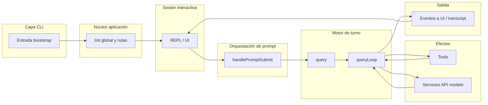

# Diagrama de flujo del agente (abstracto)

Solo arquitectura. Sin rutas de archivos ni código.

---

## Vista lineal principal (TUI interactiva)



Interpretación:

- **CLI → MAIN:** arranque y decisión de modo.
- **MAIN → REPL:** montaje de la sesión visible.
- **REPL → QUERY:** cada envío serio de input pasa por orquestación de submit y entra al motor.
- **QUERY / queryLoop:** puede alternar entre razonamiento vía API y ejecución de **TOOL** hasta cerrar el turno.
- **RESPONSE:** eventos y mensajes vuelven a la REPL (y equivalen a “respuesta” al usuario).

---

## Cadena corta (resumen)

```
CLI → MAIN → REPL → QUERY → TOOL → RESPONSE
```

En la práctica, **RESPONSE** es un flujo de eventos que **alimenta de nuevo** la REPL hasta el siguiente input.

---

## Variante conceptual: solo lectura mental

```
Usuario
  → CLI (argv)
  → MAIN (config)
  → REPL (input visual)
  → SUBMIT (semántica del enter)
  → QUERY LOOP (modelo ↔ herramientas)
  → API + TOOLS
  → REPL (output)
```
