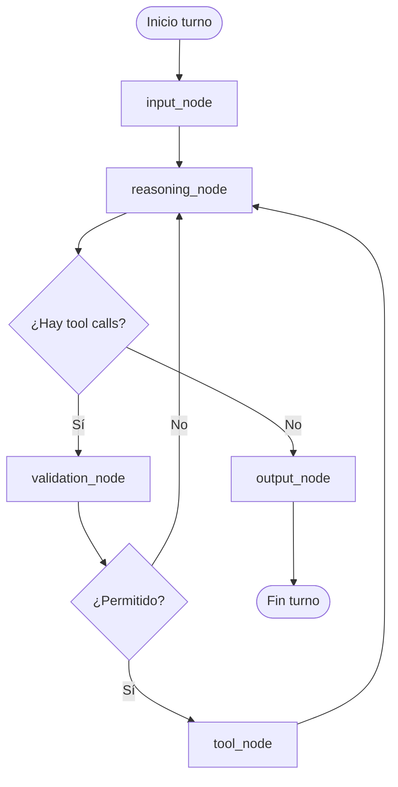

# Mapeo a LangGraph (abstracto)

Traducción **conceptual** de la arquitectura a nodos y aristas tipo LangGraph. No asume nombres de estado del código original; define un `AgentState` genérico que puedes implementar en tu proyecto.

---

## Estado sugerido (esquema)

```text
AgentState:
  messages: list[Mensaje]           # historial conversación
  user_input: str | null           # último input crudo (opcional)
  tool_calls_pending: list[ToolCall] | null
  tool_results: list[ToolResult] | null
  policy_flags: dict               # permisos, modo, etc.
  terminal: bool                   # fin del turno o de la sesión
  error: str | null
```

---

## Nodos

| Nodo | Responsabilidad (alineado al sistema de referencia) |
|------|-----------------------------------------------------|
| **input_node** | Recoger y normalizar input del usuario; comandos slash pueden desviarse aquí o en un subgrafo. |
| **reasoning_node** | Invocar al LLM con `messages` + system prompt; producir texto y/o solicitudes de herramienta. |
| **tool_node** | Ejecutar herramientas permitidas; escribir resultados en el estado / mensajes. |
| **validation_node** | Comprobar políticas, límites, formato de argumentos, consentimiento; decidir si se reintenta o se deniega. |
| **output_node** | Formatear respuesta final al usuario (y side-effects de UI / logging). |

---

## Grafo dirigido (un turno típico)



Flujo lineal pedido (resumen):

**input → reasoning → tool → validation → output**

Ajuste recomendado respecto al código real: la **validación** suele ir **antes** de ejecutar la herramienta (y a veces **después**, para validar resultados). En el diagrama anterior, `validation_node` actúa como **pre-tool**. Puedes duplicar un nodo `post_tool_validation` si tu dominio lo exige.

---

## Equivalencias informales

| Pieza de referencia | Nodo LangGraph |
|---------------------|----------------|
| REPL captura texto | `input_node` (o fuera del grafo, alimentando estado) |
| `query` / `queryLoop` | Subgrafo que alterna `reasoning_node` ↔ `tool_node` |
| `canUseTool` / permisos | Condiciones en `validation_node` o guards en aristas |
| streaming a UI | Side-effect en `reasoning_node` / `output_node` (callbacks) |

---

## Condición de parada

- El subgrafo del turno termina cuando `reasoning_node` devuelve **sin** tool calls pendientes (o cuando se alcanza un límite de iteraciones / error irrecuperable).
- La **sesión** global puede seguir con otro ciclo `input_node`.

---

## Nota MINEDU / gobierno

Si necesitas trazabilidad institucional, añade aristas obligatorias:

- `reasoning_node` → `audit_log_node` (opcional)
- `tool_node` → `policy_compliance_node` antes de `output_node`

Estos nodos no existen en el mínimo anterior; son extensiones de cumplimiento.
